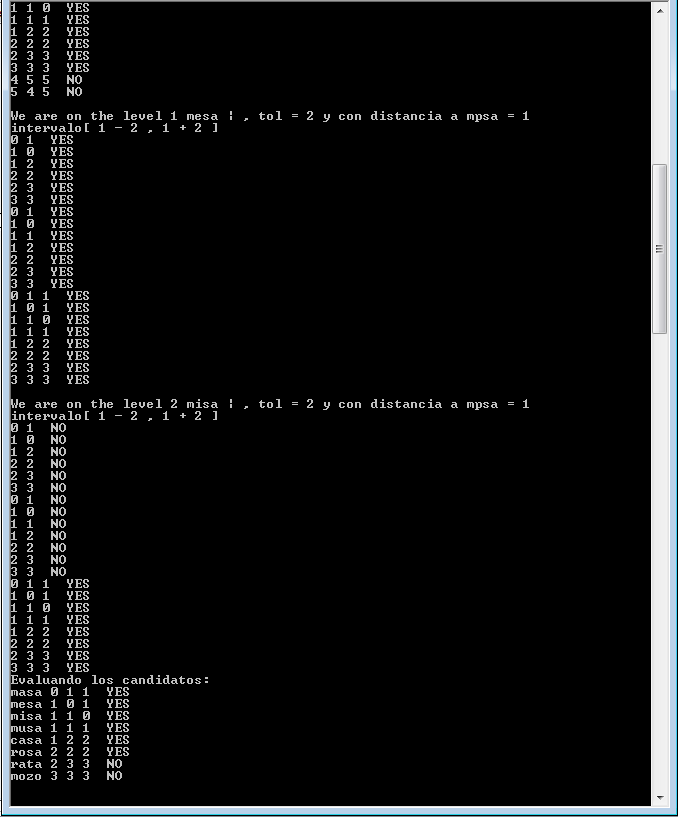

# FIXED QUERIES ARRAY - PALABRAS

El FQA esta implementado sobre el **FHFQT** para lo cual no se necesita modificar la estructura de datos, ya que solo trabajara con las distancias de los nodos(en forma de array)

## GUI - FIXED HEIGHT FIXED QUERIES TREE

## CLI - FIXED QUERIES ARRAY

